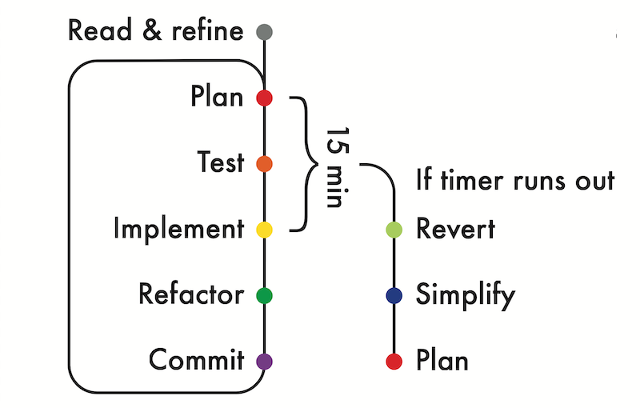

# external_review_04

## Code Review (external, from outside Makers Academy) ##

### About
- Brief given verablly by external reviewer as mock test
- 1hr test, recorded live, with feedback given after.
- Completed using **Ruby & RSpec**
- Reviewing my Test Driven Developement Process: 

### Scorecard
**General feedback** 
Excellent work! You are methodical which allows you to analyse a problem and steadily work your way towards a robust solution without racing ahead or getting stuck. I recommend that you finish this exercise on your own time (with multiple operators) and think through different architectures for your solution, with their pros and cons. 
Refer to _Hub_Review_04_Scorecard.pdf_ for full details.
 
- **I use an agile process** _Rating: Strong_
- **I can model anything** _Rating: Steady_
- **I can TDD anything** _Rating: Strong_
- **I can program fluently** _Rating: Strong_
- **I can refactor anything** _Rating: Strong_
- **I can debug anything** _Rating: Steady_
- **I write code that is easy to change** _Rating: Strong_
- **I have a methodological approach to problem solving** _Rating: Strong_
- **I can justify the way I work** _Rating: Strong_
 

### Brief

- Academic math paper, task is making it easier to read
- maths equations are extracted as strings and evaluated by a **new program**
- output - string that was inputted and the total sum, formatted into an array
- can pass in 1 or 2 terms to be evaluated in the string

**Terms**
- integer or float, zero , positive or negative

**Input example**
- "2 + 3"

**INPUT | OUTPUT TABLE**

"2" | ["2", 2.0] 

"-2" | ["-2", -2.0] 

"2 + 3" | ["2 + 3", 5.0] 

"1+1" | "Input must be a valid mathematical string separated by spaces" 

"0" | ["0", 0.0] 

"" | ["", 0.0] 

"What's up, calculator!?" | MathError  

"5 + 5 + 5 + 5" | ArgumentError  

**Nice to have**

- other operators
 
"3 - 1" | ["3 - 1", 2.0]